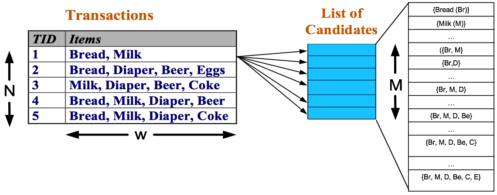
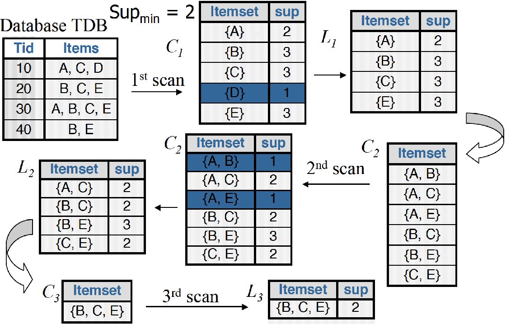
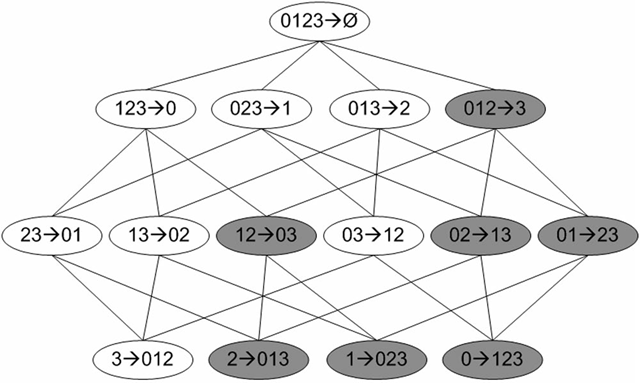
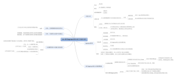

## 第十一章 使用Apriori算法进行关联分析

问题是寻找物品之间的不同组合很耗时，计算代价高，野蛮手段都不一定能解决这个问题。所以提出一些更加智能的算法在合理的时间范围内找到频繁项集。

### 关联分析

**关联分析**：从大规模数据集中寻找物品减的隐含关系，可以用在超市商品捆绑销售上。

这些隐含关系有两种形式： 频繁项集或者关联规则

**关联规则**：物品之间可能存在很强的关系

{}->{}； {啤酒}->{尿布} ： 可以表示说在超市买了啤酒的人可能会买尿布

**频繁项集**：经常出现在一起的物品集合

如何度量这些关系：一个项集的**支持度**（定义数据集中包含的记录所占的比例）。**可信度**或者**置信度**:是对于关联规则

### Apriori原理

假设某家超市只卖四样商品：0,1,2,3。

Apriori原理是说如果某个项集是频繁的，那么他的子项集也是频繁的，那么逆否命题也是成立的，也就是说：一个项集非频繁，那么他的所有超项集是非频繁的。

### Apriori 找频繁集

关联分析的目标包括两项：发现频繁项集和发现关联规则。首先需要找到频繁项集，然后才能获得关联规则。

Apriori是发现频繁项集的算法之一。该算法的输入参数是：最小支持度和置信度。

该算法首先会生成所有单个元素的项集列表。接着扫描所有的数据集来查看满足最小支持度的项集。把那些不符合最小支持度的项集去掉。



#### 生成候选项集

数据集扫描的伪代码

```
对数据集中的每条交易记录tran：
    对每个候选项集can：
        检查can是否是tran的子集
        如果是，则增加can的计数
对每个候选项集：
    如果其支持度不低于最小值，则保留该项集
返回所有频繁项集列表
```

#### Apriori算法

辅助函数部分

```
from numpy import *

def loadDataSet():
    return [[1, 3, 4], [2, 3, 5], [1, 2, 3, 5], [2, 5]]

def createC1(dataSet):
    C1 = []
    for transaction in dataSet:
        for item in transaction:
            if not [item] in C1:
                C1.append([item])
                
    C1.sort()
    return map(frozenset, C1)#use frozen set so we
                            #can use it as a key in a dict    

def scanD(D, Ck, minSupport):
    ssCnt = {}
    for tid in D:
        for can in Ck:
            if can.issubset(tid):
                if not ssCnt.has_key(can): ssCnt[can]=1
                else: ssCnt[can] += 1
    numItems = float(len(D))
    retList = []
    supportData = {}
    for key in ssCnt:
        support = ssCnt[key]/numItems
        if support >= minSupport:
            retList.insert(0,key)
        supportData[key] = support
    return retList, supportData
```

Apriori算法

整个apriori算法的伪代码是：

```
当集合中项的个数大于0的时候：
	构建一个k个项组成的候选项集的列表
	检查数据保证每个项集都是频繁的
	保留频繁项集并构建k+1项组成的候选项集的列表
```
图示意：



下面是代码部分：

```
def aprioriGen(Lk, k): #creates Ck
    retList = []
    lenLk = len(Lk)
    for i in range(lenLk):
        for j in range(i+1, lenLk): 
            L1 = list(Lk[i])[:k-2]; L2 = list(Lk[j])[:k-2]
            L1.sort(); L2.sort()
            if L1==L2: #if first k-2 elements are equal
                retList.append(Lk[i] | Lk[j]) #set union
    return retList

def apriori(dataSet, minSupport = 0.5):
    C1 = createC1(dataSet)
    D = map(set, dataSet)
    L1, supportData = scanD(D, C1, minSupport)
    L = [L1]
    k = 2
    while (len(L[k-2]) > 0):
        Ck = aprioriGen(L[k-2], k)
        Lk, supK = scanD(D, Ck, minSupport)#scan DB to get Lk
        supportData.update(supK)
        L.append(Lk)
        k += 1
    return L, supportData
```
aprioriGen函数是通过列表Lk和项集个数k生成候选项集Ck+1.

生成过程：首先对每个项集按元素进行排序，然后比较两个项集，只有在前k-1项相同的才将这两个合并。如此是因为函数并非是要两两合并各个集合，这样的话，生成的集合个数就不是k+1项的了。在限制了项数的前提下，只有在前k-1项相同的情况下才能进行合并，产生新的候选集合。

apriori函数中Ck表示项数为k的候选项集，最初的C1通过createC1()函数生成。Lk表示项数为k的频繁项集，supK为其支持度，Lk和supK由scanD()函数通过Ck计算而来。

### 频繁项集推关联规则

要找到一个关联规则需要从频繁项集开始，比如说一个频繁项集：{豆奶，莴苣}，可能就会有这样一条频繁规则："豆奶 -> 莴苣"。也就是说买了豆奶的人很大程度上会买莴苣。但是反过来并一定成立。可信度(“豆奶➞莴苣”)并不等于可信度(“莴苣➞豆奶”)。

下面图给出了从项集{0,1,2,3}产生的所有关联规则，其中阴影区域给出的是低可信度的规则。可以发现如果{0,1,2}➞{3}是一条低可信度规则，那么所有其他以3作为后件（箭头右部包含3）的规则均为低可信度的。



#### 关联规则生成函数

```
'''
L: 频繁项集列表
supportData： 包含哪些频繁项集支持数据的字典
minconf： 最小可信度阈值
'''
def generateRules(L, supportData, minConf=0.7):  # 频繁项集挖掘关联规则
    bigRuleList = [] # 保存包含可信度的规则列表
    for i in range(1, len(L)):# 只保留两个或者两个元素以上的集合
        for freqSet in L[i]: # 遍历某个频繁项集的元素
            H1 = [frozenset([item]) for item in freqSet]
            if (i > 1):
                rulesFromConseq(freqSet, H1, supportData, bigRuleList, minConf)
            else: # 计算规则的可信度，并过滤出满足最小可信度要求的规则
                calcConf(freqSet, H1, supportData, bigRuleList, minConf)
    return bigRuleList

'''
calConf: 计算规则的可信度，并筛选出满足最小可信度要求的规则
freqSet: 频繁项集
H: 候选规则集合
supportData: 保存项集支持度
brl: 保存生成的规则
minConf: 最小置信度
'''
def calcConf(freqSet, H, supportData, brl, minConf=0.7):
	# 计算规则的可信度，并过滤出满足最小可信度要求的规则
    prunedH = [] # 保存规则列表的右部
    for conseq in H:
        conf = supportData[freqSet]/supportData[freqSet-conseq]
        if conf >= minConf: 
            print freqSet-conseq,'-->',conseq,'conf:',conf
            brl.append((freqSet-conseq, conseq, conf))
            prunedH.append(conseq)
    return prunedH

'''
根据当前的候选规则集合H生成下一层候选规则集
freqSet: 频繁项集
H: 候选规则集合
supportData: 保存项集支持度
brl: 保存生成的规则
minConf: 最小置信度
'''
def rulesFromConseq(freqSet, H, supportData, brl, minConf=0.7):
    m = len(H[0])
    if (len(freqSet) > (m + 1)):
        Hmp1 = aprioriGen(H, m+1)
        Hmp1 = calcConf(freqSet, Hmp1, supportData, brl, minConf)
        if (len(Hmp1) > 1):
            rulesFromConseq(freqSet, Hmp1, supportData, brl, minConf)
```

### 一些问题

运行代码然后仔细检查输出，有发现一些问题

#### 发现问题

频繁项集L的值前面提到过。我们在其中计算通过{2, 3, 5}生成的关联规则，可以发现关联规则{3, 5}➞{2}和{2, 3}➞{5}的可信度都应该为1.0的，因而也应该包括在当minConf = 0.7时的rules中——但是这在前面的运行结果中并没有体现出来。minConf = 0.5时也是一样，{3, 5}➞{2}的可信度为1.0，{2, 5}➞{3}的可信度为2/3，{2, 3}➞{5}的可信度为1.0，也没有体现在rules中。

通过分析程序代码，我们可以发现：

- 当i = 1时，generateRules()函数直接调用了calcConf()函数直接计算其可信度，因为这时L[1]中的频繁项集均包含两个元素，可以直接生成和判断候选关联规则。比如L[1]中的{2, 3}，生成的候选关联规则为{2}➞{3}、{3}➞{2}，这样就可以了。

- 当i > 1时，generateRules()函数调用了rulesFromConseq()函数，这时L[i]中至少包含3个元素，如{2, 3, 5}，对候选关联规则的生成和判断的过程需要分层进行（图示意）。这里，将初始的H1（表示初始关联规则的右部，即箭头右边的部分）作为参数传递给了rulesFromConseq()函数。

例如，对于频繁项集{a, b, c, …}，H1的值为[a, b, c, …]（代码中实际为frozenset类型）。如果将H1带入计算可信度的calcConf()函数，在函数中会依次计算关联规则{b, c, d, …}➞{a}、{a, c, d, …}➞{b}、{a, b, d, …}➞{c}……的支持度，并保存支持度大于最小支持度的关联规则，并保存这些规则的右部（prunedH，即对H的过滤，删除支持度过小的关联规则）。

当i > 1时没有直接调用calcConf()函数计算通过H1生成的规则集。在rulesFromConseq()函数中，首先获得当前H的元素数m = len(H[0])（记当前的H为HmHm）。当HmHm可以进一步合并为m+1元素数的集合Hm+1Hm+1时（判断条件：len(freqSet) > (m + 1)），依次：

- 生成Hm+1Hm+1：Hmpl = aprioriGen(H, m + 1)

- 计算Hm+1Hm+1的可信度：Hmpl = 

- calcConf(freqSet, Hmpl, …)

- 递归计算由Hm+1Hm+1生成的关联规则：rulesFromConseq(freqSet, Hmpl, …)
所以这里的问题是，在i>1时，rulesFromConseq()函数中并没有调用calcConf()函数计算H1的可信度，而是直接由H1生成H2，从H2开始计算关联规则——于是由元素数>3的频繁项集生成的{a, b, c, …}➞{x}形式的关联规则（图4中的第2层）均缺失了。由于代码示例数据中的对H1的剪枝prunedH没有删除任何元素，结果只是“巧合”地缺失了一层。正常情况下如果没有对H1进行过滤，直接生成H2，将给下一层带入错误的结果（如图4中的012➞3会被错误得留下来）。

#### 解决问题

在i>1时，将对H1调用calcConf()的过程加上就可以了。比如可以这样：

```
def generateRules2(L, supportData, minConf=0.7):
    bigRuleList = []
    for i in range(1, len(L)):
        for freqSet in L[i]:
            H1 = [frozenset([item]) for item in freqSet]
            if (i > 1):
                # 三个及以上元素的集合
                H1 = calcConf(freqSet, H1, supportData, bigRuleList, minConf)
                rulesFromConseq(freqSet, H1, supportData, bigRuleList, minConf)
            else:
                # 两个元素的集合
                calcConf(freqSet, H1, supportData, bigRuleList, minConf)
    return bigRuleList
```

这里就只需要修改generateRules()函数。这样实际运行效果中，刚才丢失的那几个关联规则就都出来了。

#### 再修改

进一步修改：当i=1时的else部分并没有独特的逻辑，这个if语句可以合并，然后再修改rulesFromConseq()函数，保证其会调用calcConf(freqSet, H1, …)：

```
def generateRules3(L, supportData, minConf=0.7):
    bigRuleList = []
    for i in range(1, len(L)):
        for freqSet in L[i]:
            H1 = [frozenset([item]) for item in freqSet]
            rulesFromConseq2(freqSet, H1, supportData, bigRuleList, minConf)
    return bigRuleList
 
def rulesFromConseq2(freqSet, H, supportData, brl, minConf=0.7):
    m = len(H[0])
    if (len(freqSet) > m): # 判断长度改为 > m，这时即可以求H的可信度
        Hmpl = calcConf(freqSet, H, supportData, brl, minConf)
        if (len(Hmpl) > 1): # 判断求完可信度后是否还有可信度大于阈值的项用来生成下一层H
            Hmpl = aprioriGen(Hmpl, m + 1)
            rulesFromConseq2(freqSet, Hmpl, supportData, brl, minConf) # 递归计算，不变
```

运行结果和generateRules2相同。


进一步修改：消除rulesFromConseq2()函数中的递归项。这个递归纯粹是偷懒的结果，没有简化任何逻辑和增加任何可读性，可以直接用一个循环代替：

```
def rulesFromConseq3(freqSet, H, supportData, brl, minConf=0.7):
    m = len(H[0])
    while (len(freqSet) > m): # 判断长度 > m，这时即可求H的可信度
        H = calcConf(freqSet, H, supportData, brl, minConf)
        if (len(H) > 1): # 判断求完可信度后是否还有可信度大于阈值的项用来生成下一层H
            H = aprioriGen(H, m + 1)
            m += 1
        else: # 不能继续生成下一层候选关联规则，提前退出循环
            break
```

另一个主要的区别是去掉了多余的Hmpl变量。运行的结果和generateRules2相同。

至此，一个完整的Apriori算法就完成了。

### 实战

发现美国国会投票中的模式

数据集有：

recent100bills.txt  100条议案标题以及id

recent20biils.txt   将上文本文件的billId转为actionId，并非所有的议案都被投票过，另外一些议案再多处进行了议案投票。需要对actionId进行过滤只保留投票数据的actionId。处理以后得到此文件。

收集美国国会议案中的actionId的函数：

```

```

### 总结

关联分析是用于发现大数据集中元素间有趣关系的一个工具集，可以采用两种方式来量化这些有趣的关系。第一种方式是使用频繁项集，它会给出经常在一起出现的元素项。第二种方式是关联规则，每条关联规则意味着元素项之间的“如果……那么”关系。

发现元素项间不同的组合是个十分耗时的任务，不可避免需要大量昂贵的计算资源，这就需要一些更智能的方法在合理的时间范围内找到频繁项集。能够实现这一目标的一个方法是Apriori算法，它使用Apriori原理来减少在数据库上进行检查的集合的数目。Apriori原理是说如果一个元素项是不频繁的，那么那些包含该元素的超集也是不频繁的。Apriori算法从单元素项集开始，通过组合满足最小支持度要求的项集来形成更大的集合。支持度用来度量一个集合在原始数据中出现的频率。

关联分析可以用在许多不同物品上。商店中的商品以及网站的访问页面是其中比较常见的例子。

每次增加频繁项集的大小，Apriori算法都会重新扫描整个数据集。当数据集很大时，这会显著降低频繁项集发现的速度。下面会介绍FP-growth算法，和Apriori算法相比，该算法只需要对数据库进行两次遍历，能够显著加快发现频繁项集的速度。

接一张本章的思维导图，帮助记忆：



参考： `http://www.cnblogs.com/qwertWZ/p/4510857.html`