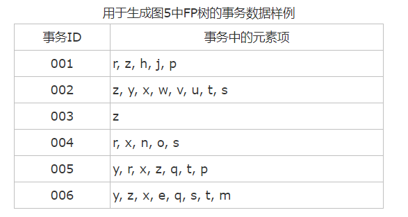
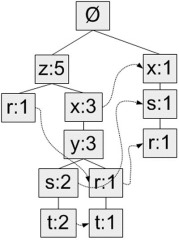
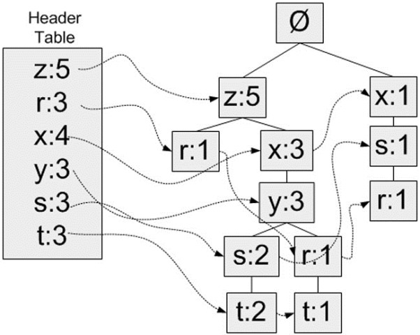
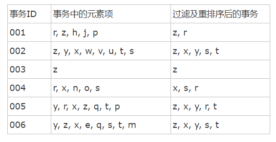
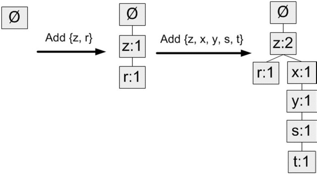
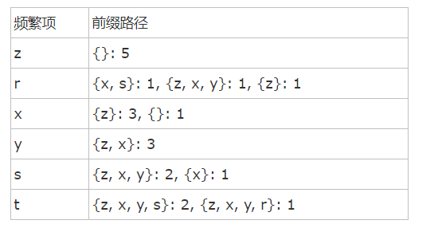
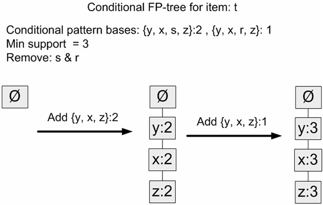
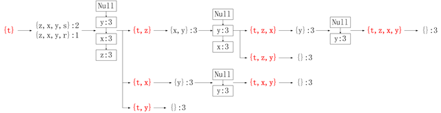
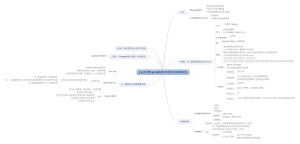

## 第十二章 使用FP-growth算法来高效发现频繁项集

Fp-growth算法是基于Apriori构建的，但是采用了高级的数据结构减少扫描次数，大大加快了算法速度。FP-growth算法只需要对数据库进行两次扫描。apriori算法是每次找潜在的频繁项集都会扫描数据集判定模式是否频繁。因此FP-growth算法的速度要比apriori算法快。

FP-growth算法发现频繁项集的基本过程如下：

- 构建FP树

- 从FP树中挖掘频繁项集

FP-growth算法优缺点：

- 优点：一般要快于apriori

- 缺点：实现比较困难，在某些数据集上性能会下降

- 使用数据集类型： 离散型数据

### FP树：用于编码数据集的有效方式

FP（frequent Pattern）

与搜索树不同的是，一个元素项可以在一棵FP树种出现多次。FP树辉存储项集的出现频率，而每个项集会以路径的方式存储在数中。存在相似元素的集合会共享树的一部分。只有当集合之间完全不同时，树才会分叉。 树节点上给出集合中的单个元素及其在序列中的出现次数，路径会给出该序列的出现次数。

FP-growth算法的工作流程如下。首先构建FP树，然后利用它来挖掘频繁项集。为构建FP树，需要对原始数据集扫描两遍。**第一遍对所有元素项的出现次数进行计数。**数据库的第一遍扫描用来统计出现的频率，**而第二遍扫描中只考虑那些频繁元素。**

下面是对应的数据样本和对应的FP-树



对应的FP树是：下面具体解释这个树的构建

样本元素项z出现了5次，集合{r, z}出现了1次。于是可以得出结论：z一定是自己本身或者和其他符号一起出现了4次。集合{t, s, y, x, z}出现了2次，集合{t, r, y, x, z}出现了1次，z本身单独出现1次。就像这样，FP树的解读方式是读取某个节点开始到根节点的路径。路径上的元素构成一个频繁项集，开始节点的值表示这个项集的支持度。根据图5，我们可以快速读出项集{z}的支持度为5、项集{t, s, y, x, z}的支持度为2、项集{r, y, x, z}的支持度为1、项集{r, s, x}的支持度为1。FP树中会多次出现相同的元素项，也是因为同一个元素项会存在于多条路径，构成多个频繁项集。但是频繁项集的共享路径是会合并的，如图中的{t, s, y, x, z}和{t, r, y, x, z}

和之前一样，我们取一个最小阈值，出现次数低于最小阈值的元素项将被直接忽略。本例子中将最小支持度设为3，所以q和p没有在FP中出现。

### 构建FP树

#### FP的数据结构

```
class treeNode:
	def __init__(self, namevalue, numOccur, parentNode):
		self.name = namevalue
		self.count = numOccur
		self.nodeLink = None # 用来链接相似的元素项
		self.parent = parentNode
		self.children = {} # 存放节点的子节点

	def inc(self, numOccur):# count变量变化
		self.count += numOccur

	def disp(self, ind = 1):# 将树以文本行为表现出来
		print (' ' * ind), self.name, ' ', self.count
		for child in self.children.values():
			child.disp(ind+1)
```

每个树节点由五个数据项组成：

- name：节点元素名称，在构造时初始化为给定值

- count：出现次数，在构造时初始化为给定值

- nodeLink：指向下一个相似节点的指针，默认为None

- parent：指向父节点的指针，在构造时初始化为给定值

- children：指向子节点的字典，以子节点的元素名称为键，指向子节点的指针为值，初始化为空字典

成员函数：

- inc()：增加节点的出现次数值

- disp()：输出节点和子节点的FP树结构

#### 构建FP树

构建FP树分为三个部分来进行。第一是头指针，第二是元素项排序，最后是构建FP树。

##### 头指针结构

FP-growth算法还需要一个称为头指针表的数据结构，其实很简单，就是用来记录各个元素项的总出现次数的数组，再附带一个指针指向FP树中该元素项的第一个节点。这样每个元素项都构成一条单链表。图示说明：



这里使用Python字典作为数据结构，来保存头指针表。以元素项名称为键，保存出现的总次数和一个指向第一个相似元素项的指针。

第一次遍历数据集会获得每个元素项的出现频率，去掉不满足最小支持度的元素项，生成这个头指针表。

##### 元素项排序

上文提到过，FP树会合并相同的频繁项集（或相同的部分）。因此为判断两个项集的相似程度需要对项集中的元素进行排序（不过原因也不仅如此，还有其它好处）。排序基于元素项的绝对出现频率（总的出现次数）来进行。在第二次遍历数据集时，会读入每个项集（读取），去掉不满足最小支持度的元素项（过滤），然后对元素进行排序（重排序）。

对示例数据集进行过滤和重排序的结果如下：



##### FP树构建

从空集开始，将过滤和重排序后的频繁项集一次添加到树中。如果树中已存在现有元素，则增加现有元素的值；如果现有元素不存在，则向树添加一个分支。对前两条事务进行添加的过程：



算法：构建FP树

```
输入：数据集、最小值尺度
输出：FP树、头指针表
   遍历数据集，统计各元素项出现次数，创建头指针表
   移除头指针表中不满足最小值尺度的元素项
   第二次遍历数据集，创建FP树。对每个数据集中的项集：
        初始化空FP树
        对每个项集进行过滤和重排序
        使用这个项集更新FP树，从FP树的根节点开始：
              如果当前项集的第一个元素项存在于FP树当前节点的子节点中，则更新这个子节点的计数值
              否则，创建新的子节点，更新头指针表
              对当前项集的其余元素项和当前元素项的对应子节点递归3.3的过程
```

总函数：createTree

```
def createTree(dataSet, minSup=1):
    ''' 创建FP树 '''
    # 第一次遍历数据集，创建头指针表
    headerTable = {}
    for trans in dataSet:
        for item in trans:
            headerTable[item] = headerTable.get(item, 0) + dataSet[trans]
    # 移除不满足最小支持度的元素项
    for k in headerTable.keys():
        if headerTable[k] < minSup:
            del(headerTable[k])
    # 空元素集，返回空
    freqItemSet = set(headerTable.keys())
    if len(freqItemSet) == 0:
        return None, None
    # 增加一个数据项，用于存放指向相似元素项指针
    for k in headerTable:
        headerTable[k] = [headerTable[k], None]
    retTree = treeNode('Null Set', 1, None) # 根节点
    # 第二次遍历数据集，创建FP树
    for tranSet, count in dataSet.items():
        localD = {} # 对一个项集tranSet，记录其中每个元素项的全局频率，用于排序
        for item in tranSet:
            if item in freqItemSet:
		# 注意这个[0]，因为之前加过一个数据项
                localD[item] = headerTable[item][0] 
	# 排序
        if len(localD) > 0:
            orderedItems = [v[0] for v in sorted(localD.items(), key=lambda p: p[1], reverse=True)] 
            
            updateTree(orderedItems, retTree, headerTable, count) # 更新FP树
    return retTree, headerTable

def updateTree(items, inTree, headerTable, count):
    if items[0] in inTree.children:
        # 有该元素项时计数值+1
        inTree.children[items[0]].inc(count)
    else:
        # 没有这个元素项时创建一个新节点
        inTree.children[items[0]] = treeNode(items[0], count, inTree)
        # 更新头指针表或前一个相似元素项节点的指针指向新节点
        if headerTable[items[0]][1] == None:
            headerTable[items[0]][1] = inTree.children[items[0]]
        else:
            updateHeader(headerTable[items[0]][1], inTree.children[items[0]])
 
    if len(items) > 1:
        # 对剩下的元素项迭代调用updateTree函数
        updateTree(items[1::], inTree.children[items[0]], headerTable, count)

def updateHeader(nodeToTest, targetNode):
    while (nodeToTest.nodeLink != None):
        nodeToTest = nodeToTest.nodeLink
    nodeToTest.nodeLink = targetNode
```

### FP树挖掘频繁项集

到现在为止大部分比较困难的工作已经处理完了。有了FP树之后，就可以抽取频繁项集了。这里的思路与Apriori算法大致类似，首先从单元素项集合开始，然后在此基础上逐步构建更大的集合。

从FP树中抽取频繁项集的三个基本步骤如下：

- 从FP树中获得条件模式基 conditional pattern base；

- 利用条件模式基，构建一个条件FP树；

- 迭代重复步骤1步骤2，直到树包含一个元素项为止。

#### Conditional pattern base

首先从头指针表中的每个频繁元素项开始，对每个元素项，获得其对应的条件模式基（conditional pattern base）。条件模式基是以所查找元素项为结尾的路径集合。每一条路径其实都是一条前缀路径（prefix path）。简而言之，一条前缀路径是介于所查找元素项与树根节点之间的所有内容。



发现规律了吗，z存在于路径{z}中，因此前缀路径为空，另添加一项该路径中z节点的计数值5构成其条件模式基；r存在于路径{r, z}、{r, y, x, z}、{r, s, x}中，分别获得前缀路径{z}、{y, x, z}、{s, x}，另添加对应路径中r节点的计数值（均为1）构成r的条件模式基；以此类推。

前缀路径将在下一步中用于构建条件FP树，暂时先不考虑。如何发现某个频繁元素项的所在的路径？利用先前创建的头指针表和FP树中的相似元素节点指针，我们已经有了每个元素对应的单链表，因而可以直接获取。

```
def findPrefixPath(basePat, treeNode):
    ''' 创建前缀路径 '''
    condPats = {}
    while treeNode != None:
        prefixPath = []
        ascendTree(treeNode, prefixPath)
        if len(prefixPath) > 1:
            condPats[frozenset(prefixPath[1:])] = treeNode.count
        treeNode = treeNode.nodeLink
    return condPats

'''
修改prefixPath的值，将当前节点leafNode添加到prefixPath的末尾，然后递归添加其父节点。
最终结果，prefixPath就是一条从treeNode（包括treeNode）到根节点（不包括根节点）的路径。
在主函数findPrefixPath()中再取prefixPath[1:]，即为treeNode的前缀路径。
'''
def ascendTree(leafNode, prefixPath):
    if leafNode.parent != None:
        prefixPath.append(leafNode.name)
        ascendTree(leafNode.parent, prefixPath)
```

创建一棵条件FP树的过程如下图：



#### 递归查找频繁项集
有了FP树和条件FP树，我们就可以在前两步的基础上递归得查找频繁项集。

递归的过程是这样的：

```
输入：我们有当前数据集的FP树（inTree，headerTable）
   初始化一个空列表preFix表示前缀
   初始化一个空列表freqItemList接收生成的频繁项集（作为输出）
   对headerTable中的每个元素basePat（按计数值由小到大），递归：
            记basePat + preFix为当前频繁项集newFreqSet
            将newFreqSet添加到freqItemList中
            计算t的条件FP树（myCondTree、myHead）
            当条件FP树不为空时，继续下一步；否则退出递归
            以myCondTree、myHead为新的输入，以newFreqSet为新的preFix，外加freqItemList，递归这个过程
```

```

'''
输入参数：
inTree和headerTable是由createTree()函数生成的数据集的FP树
minSup: 最小支持度
preFix: 初始传入一个空集合（set([])），用于保存当前前缀
freqItemList：初始传入一个空列表（[]），用来储存生成的频繁项集
'''
def mineTree(inTree, headerTable, minSup, preFix, freqItemList):
    bigL = [v[0] for v in sorted(headerTable.items(), key=lambda p: p[1])]
    for basePat in bigL:
        newFreqSet = preFix.copy()
        newFreqSet.add(basePat)
        freqItemList.append(newFreqSet)
        condPattBases = findPrefixPath(basePat, headerTable[basePat][1])
        myCondTree, myHead = createTree(condPattBases, minSup)
 
        if myHead != None:
            # 用于测试
            print 'conditional tree for:', newFreqSet
            myCondTree.disp()
 
            mineTree(myCondTree, myHead, minSup, newFreqSet, freqItemList)
```

测试代码：

```
>>> freqItems = []
>>> fpGrowth.mineTree(myFPtree, myHeaderTab, 3, set([]), freqItems)
>>> freqItems
[set(['y']), set(['y', 'x']), set(['y', 'z']), set(['y',\
 'x', 'z']), set(['s']), set(['x', 's']), set(['t']),\
 set(['z', 't']), set(['x', 'z', 't']), set(['y', 'x', 'z',\
 't']), set(['y', 'z', 't']), set(['x', 't']), set(['y',\
 'x', 't']), set(['y', 't']), set(['r']), set(['x']), set(['x', 'z']), set(['z'])]
```

下面举例解释上面的递归代码，清楚易懂。我们在这里分解输入myFPtree和myHeaderTab后，“for basePat in bigL:”一行当basePat为’t’时的过程：




### 总结

FP-growth算法是一种用于发现数据集中频繁模式的有效方法。FP-growth算法利用Apriori原则，执行更快。Apriori算法产生候选项集，然后扫描数据集来检查它们是否频繁。由于只对数据集扫描两次，因此FP-growth算法执行更快。在FP-growth算法中，数据集存储在一个称为FP树的结构中。FP树构建完成后，可以通过查找元素项的条件基及构建条件FP树来发现频繁项集。该过程不断以更多元素作为条件重复进行，直到FP树只包含一个元素为止。

FP-growth算法还有一个map-reduce版本的实现，它也很不错，可以扩展到多台机器上运行。Google使用该算法通过遍历大量文本来发现频繁共现词，其做法和我们刚才介绍的例子非常类似（参见扩展阅读：FP-growth算法）。

思维导图



参考 `http://www.cnblogs.com/qwertWZ/p/4510857.html#_label3`

完整代码参考我的`github zolanunu`